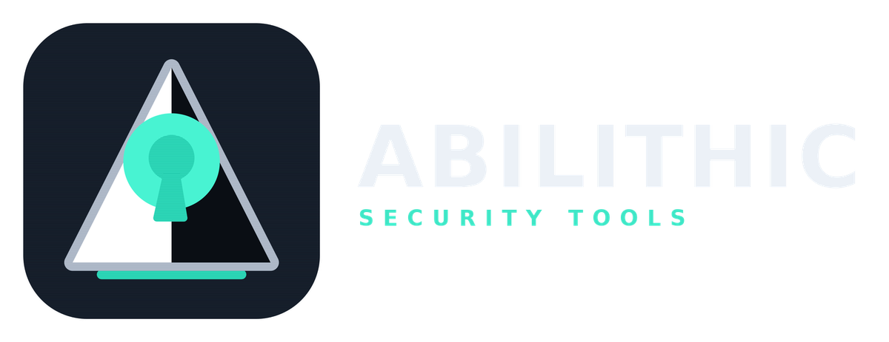
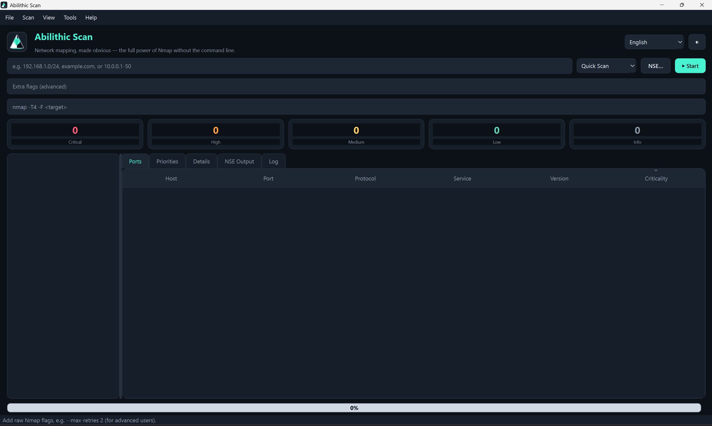
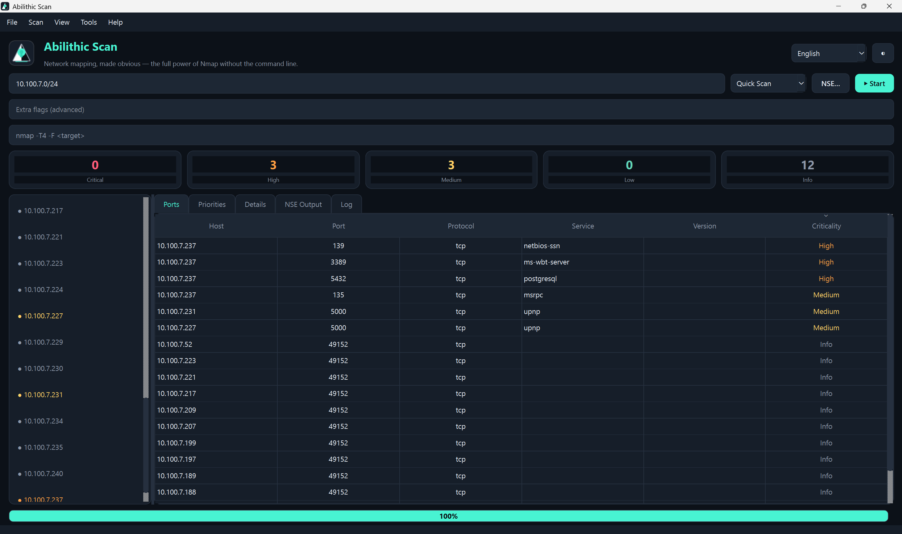
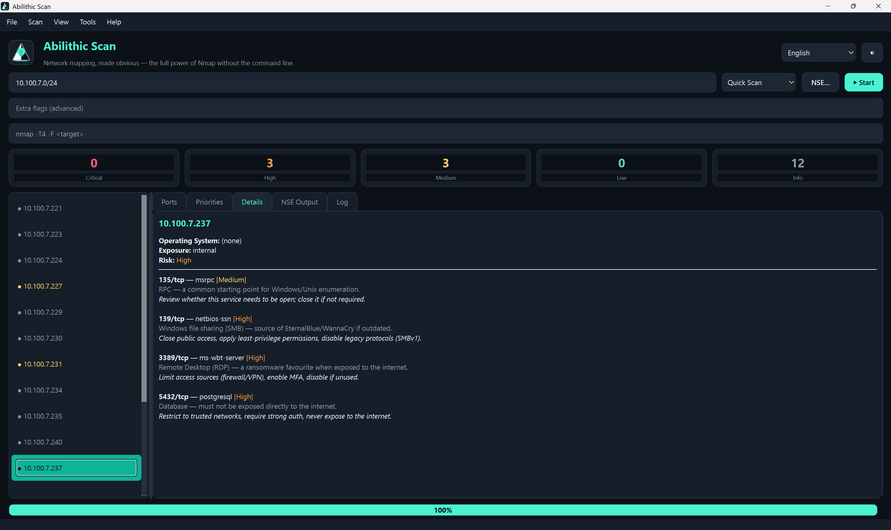
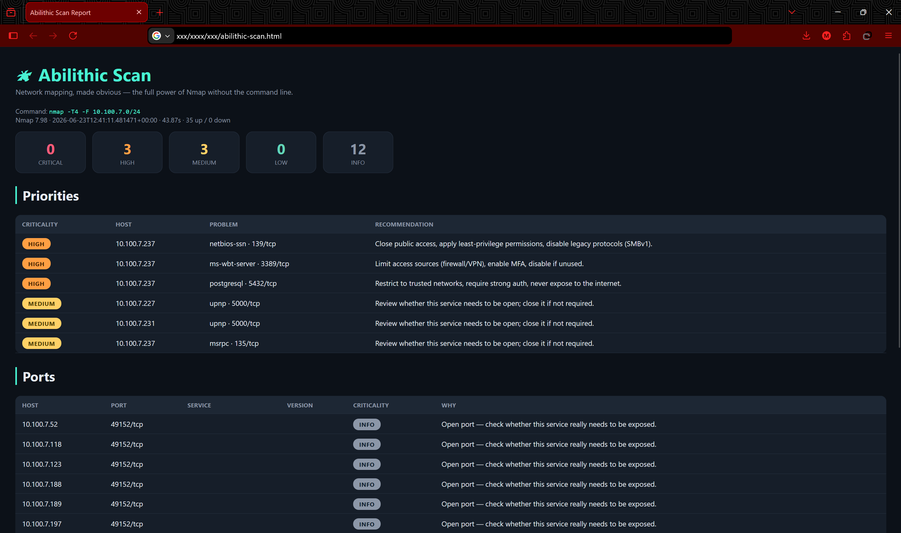
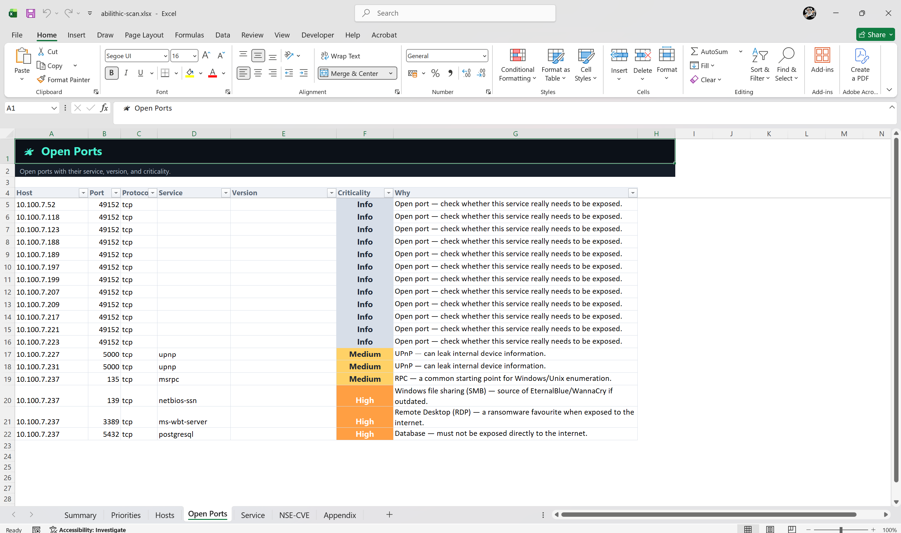

<div align="center">


# 🛰️ Abilithic Scan

### Network Mapping, Made Obvious — *the full power of Nmap, without the command line.*

Point it at a target, pick a profile, and get a clean, color-coded map of every
open port — each one **automatically rated by how much it matters** (RDP open?
that's flagged **HIGH/CRITICAL**), with a one-click **formatted Excel report**.
Beginner-friendly, bilingual (Indonesia / English), one Windows app — click and run.

[](LICENSE)
[]()
[]()
[](https://nmap.org)
[](https://www.linkedin.com/in/abil-khosim-itsec/)



[⬇️ Install](#-installation) · [✨ Features](#-key-features) · [📖 Usage](#-how-to-use) · [🎛️ Menu guide](#-what-each-menu-does-beginner-hints) · [⚠️ Disclaimer](DISCLAIMER.md)

</div>

---

## 🧩 The Problem

Nmap is the gold standard for network mapping — but it has hundreds of flags,
and its output is raw text. Beginners see `3389/tcp open ms-wbt-server` and have
no idea it's dangerous. Zenmap (the classic GUI) is dated, its exports are XML,
and it doesn't tell you what's *risky*.

**Abilithic Scan** wraps the real Nmap engine in a clean desktop app that:

- exposes **all** of Nmap's techniques and **600+ NSE scripts**, with a plain-language hint on every option,
- **automatically scores the criticality** of each open port so you know what to look at first,
- exports a **polished, multi-sheet Excel report** (not raw CSV),
- speaks **Indonesian and English**, and runs from a single `.exe`.

## ✨ Key Features

- 🎯 **Ready profiles** — Quick, Quick+Version, Intense, Intense (All/UDP), Ping
  Sweep, Discovery, Vuln, Stealth — plus raw **Custom Flags** for power users.
- 🧠 **Port Criticality Engine** — every open port gets a transparent, context-aware
  severity (e.g. RDP/SMB/Redis), *with the reason in plain language* and a fix tip.
  Internet-facing services and known-exploited CVEs are escalated automatically.
- 🥇 **Priorities view** — a ranked "what to fix first" list for non-experts.
- 🧬 **Full NSE picker** — the 14 categories + curated bundles (vuln, SMB, HTTP,
  SSL, DNS, CVE correlation), custom expressions and script-args, with safety badges.
- 👁️ **Live command preview + Learning Mode** — see the exact Nmap command that
  runs, and learn what each flag means.
- 📊 **Formatted Excel report** — Summary, Priorities, Hosts, Open Ports, Services,
  NSE/CVE, Appendix — color-coded, filterable, print-ready. Also HTML / JSON / CSV.
- 🌍 **Bilingual** — full Indonesian / English UI *and* reports.
- 🎨 **Modern GUI** — dark/light themes, sortable table, a hint on every menu.
- 🛡️ **Safe by default** — authorization prompt, polite timing, TCP-Connect
  fallback when not running as admin.
- 💻 **Single `.exe`** — built with PyInstaller; bundles the Nmap engine.

## 🖼️ Screenshots

<div align="center">

**Main window** — type a target, pick a profile, see the live command preview.



**Live results** — open ports stream in, color-coded by criticality (High, Medium, Info).



**Host details** — per-port reasons and plain-language fix advice for each finding.



**HTML report** — shareable, with a ranked Priorities table and full port list.



**Excel report** — polished, multi-sheet, severity-colored, print-ready.



</div>

## 💻 System Requirements

| | Minimum | Recommended |
|---|---|---|
| **OS** | **Windows 10 64-bit (version 1809+)** or **Windows 11** | Windows 11 64-bit |
| RAM | 2 GB | 4 GB+ |
| Disk | ~200 MB free (with bundled Nmap) | 300 MB |
| Privileges | Works as a normal user (TCP Connect). **Administrator** needed for SYN/UDP/OS scans | Run as Administrator |
| Driver | **Npcap** (for SYN/UDP/OS scans) — the app guides you to install it | Npcap installed |

> **Why Windows 10+ only?** The GUI uses Qt 6 (PySide6), which dropped support for
> Windows 7/8. The code also runs from source on Linux/macOS (`python main.py`),
> but official binaries target Windows.

## ⬇️ Installation

### For users (recommended)
1. Go to **[Releases](../../releases)**.
2. Download **`AbilithicScan.exe`** (latest version).
3. Double-click to run — no installation needed.
4. On first launch, if **Npcap** isn't installed, the app will guide you. Without
   it, TCP Connect scans still work.

> First launch may show Windows SmartScreen because the `.exe` isn't code-signed.
> Click **More info → Run anyway**. Verify integrity with the published
> `AbilithicScan.exe.sha256.txt`.

### For developers (run from source)
```bash
git clone https://github.com/<you>/abilithic-scan.git
cd abilithic-scan
python -m venv .venv && .venv\Scripts\activate     # Windows
pip install -r requirements.txt
python main.py
```
You need an `nmap` available — either installed system-wide (on PATH) or dropped
into `abilithic_scan/data/nmap/` (see that folder's README).

### Build the .exe yourself
```bat
:: Windows, one click:
build.bat
:: or manually:
pip install -r requirements-dev.txt
pyinstaller abilithic-scan.spec --noconfirm --clean
:: -> dist\AbilithicScan.exe
```
To ship a **self-contained** binary, place a Windows Nmap build into
`abilithic_scan/data/nmap/` before building (see
[`abilithic_scan/data/nmap/README.md`](abilithic_scan/data/nmap/README.md) and
the licensing note below).

## 📖 How to Use

1. **Type a target** — an IP, hostname, range, or CIDR
   (e.g. `192.168.1.0/24`, `example.com`, `10.0.0.1-50`). Separate several with spaces.
2. **Pick a profile** (start with **Quick Scan**) — or add **NSE scripts** and
   **Custom Flags**. Watch the **command preview** update live.
3. Click **▶ Start**. Confirm you're authorized. Watch the live log + progress/ETA;
   **Cancel** any time.
4. Browse the **Ports** table (color-coded by criticality) and the **host list**.
   Click a host for **Details** (OS, exposure, per-port reasons & advice).
5. Open the **Priorities** tab to see what needs attention first.
6. **Export** → **Excel** (recommended), HTML, JSON, or CSV. Save scans and reopen
   them later.

### Command line (optional)
```bash
python -m abilithic_scan.cli 192.168.1.0/24 --profile quick --lang en --excel report.xlsx
```

## 🎛️ What Each Menu Does (beginner hints)

Every menu item also shows a hint in the status bar when you hover it, in your
chosen language.

| Menu | What it does |
|---|---|
| **File ▸ New Scan** | Clear results and start a fresh target. |
| **File ▸ Open / Save Result** | Reopen or save a full scan (`.json`). |
| **File ▸ Import Targets** | Load a target list from a `.txt` file. |
| **File ▸ Export ▸ Excel** | Polished `.xlsx` report with a Priorities sheet. |
| **File ▸ Export ▸ HTML / JSON / CSV** | Share, automate, or open as a raw sheet. |
| **Scan ▸ Start / Cancel** | Run or safely stop a scan. |
| **Scan ▸ NSE Scripts** | Pick deep-check scripts (vuln detection, enumeration…). |
| **View ▸ Theme** | Toggle dark / light. |
| **View ▸ Learning Mode** | Show the Nmap flags & an explanation for each choice. |
| **View ▸ Language** (top-right) | Bahasa Indonesia / English. |
| **Tools ▸ Nmap Version / Npcap Status** | Check the engine and capture driver. |
| **Help ▸ Quick Start / Licenses / Disclaimer / About** | Guide, licenses, ethics, credits. |

## ⚙️ How it Works

```
target → command builder → Nmap engine (-oX) → XML parser → models
       → exposure classify → Port Criticality Engine → priorities & roll-up
       → live table + Excel / HTML / JSON / CSV
```

The app never reimplements Nmap; it runs the real engine and parses its XML, so
every Nmap technique and script is available and stays current with the bundled
Nmap version. The **Port Criticality Engine** then adds meaning: a base severity
per service (from an editable knowledge base), raised by internet exposure,
cleartext protocols, missing authentication (from NSE evidence), and known CVEs —
with every contributing reason recorded so you can see *why*.

## 🗺️ Roadmap

- **v1.1** — Compare/diff scans (newly opened ports), topology view, scheduler, pause/resume UI.
- **v1.2** — Richer CVE/KEV summaries in Excel, PDF export, company-branded report templates.
- **v2.0 (Abilithic Atlas)** — merge Recon + Scan: domain → subdomain → host → port → service → vulnerability in one flow.

## ⚖️ Licensing note

Abilithic Scan's own code is **MIT**. It runs **Nmap**, which is under the
**Nmap Public Source License (NPSL)**, and relies on **Npcap**, which has its own
license and **may not be redistributed without permission**. The app therefore
does not redistribute Npcap (it guides you to the official installer). If you
publish a build that bundles `nmap.exe`, comply with the NPSL. See
[THIRD-PARTY-LICENSES.md](THIRD-PARTY-LICENSES.md).

## ⚠️ Disclaimer

For **authorized security testing and educational use only**. Scan only systems
you own or are permitted to test. See [DISCLAIMER.md](DISCLAIMER.md).

## 📄 License

[MIT](LICENSE) © 2026 Abil Khosim. Nmap and Npcap are the property of their
respective owners.

---

<div align="center">

### 👤 Developed by **Abil Khosim** — *Cybersecurity Specialist*

[](https://www.linkedin.com/in/abil-khosim-itsec/)

*Abilithic Scan* is an original project by Abil Khosim, part of the Abilithic
family (Recon · Scan · Atlas). Released under the MIT License — please keep this
attribution when reusing.

<sub>Security, built like stone. 🛡️</sub>

</div>

<!-- GitHub topics: nmap, gui, port-scanner, network-scanner, cybersecurity,
security-tools, zenmap-alternative, pentesting, vulnerability-scanner, nse,
pyside6, python, windows, desktop-app, excel-report, bilingual -->
